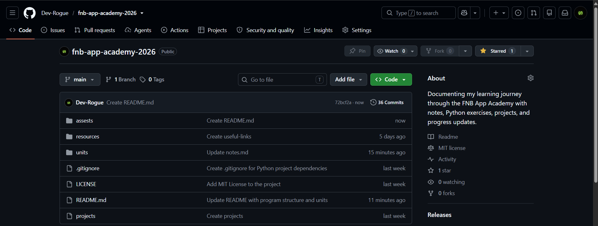
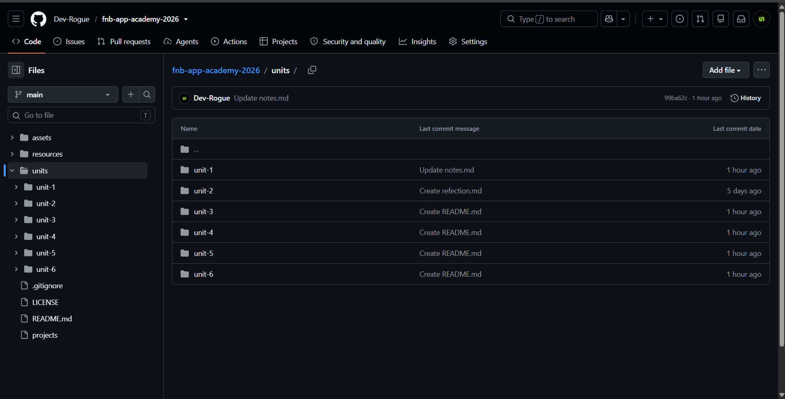
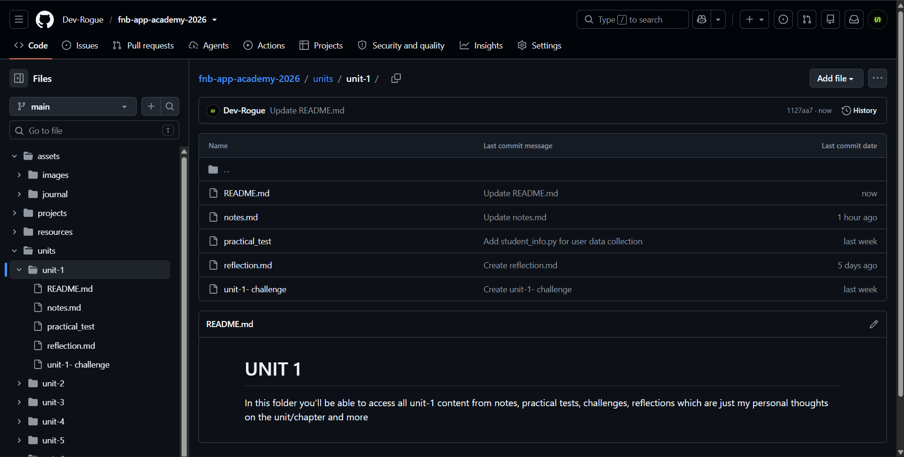
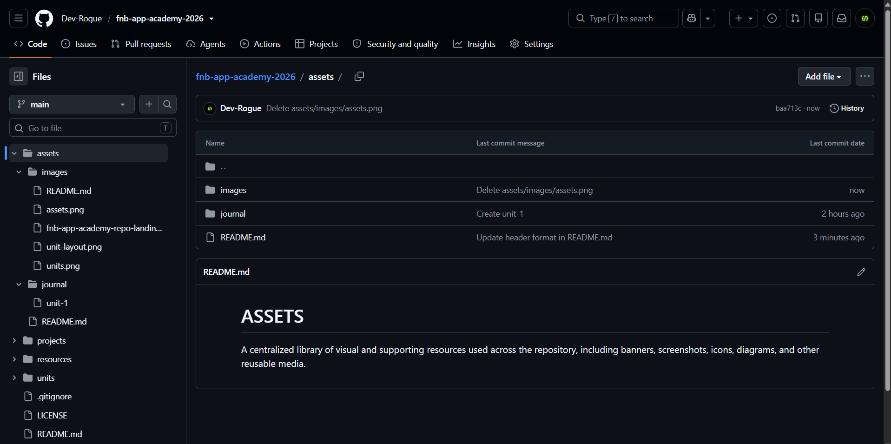
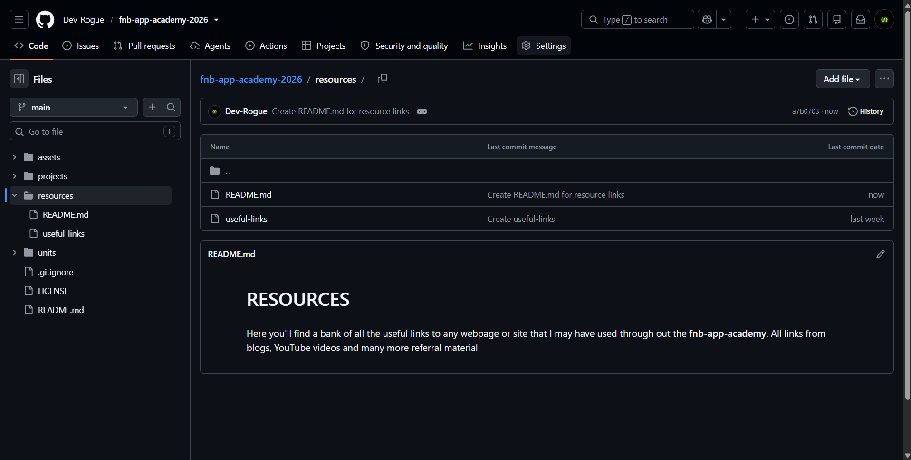
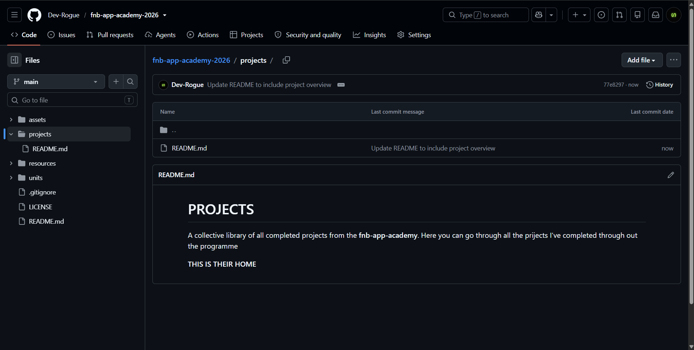
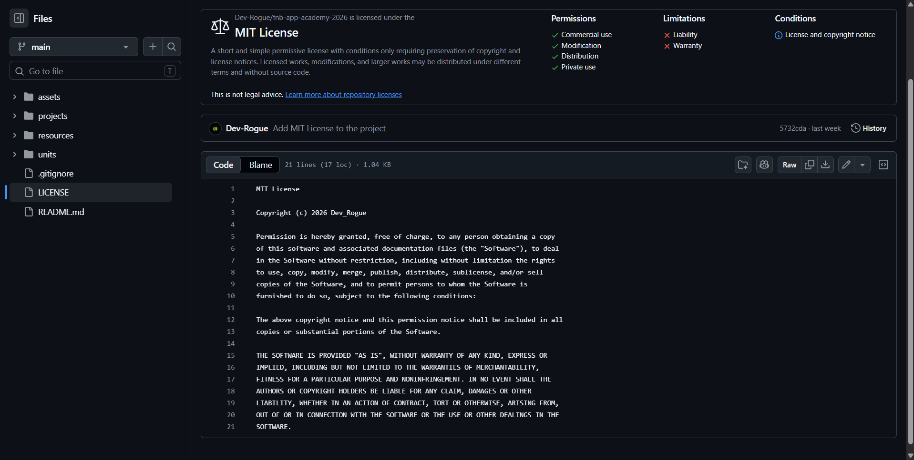

# fnb-app-academy
This will be the home of my FNB App Academy journey documentation. You'll be able to go through each and every stage that I encountered as I went through the 9 week programme

Below is the layout of how the programme is structured from start to finish. Things might change on this page as I go through the programme all in the name of just giving you a summary of what to expect as you go through this documentation of my journwy through the programme. The units are arranged in the following manner

### PYTHON FUNDAMENTALS

**Unit 1: Intro to Python**

**Unit 2: Manipulating Strings**

**Unit 3: Manipulating Numbers**

**Unit 4: Storage & Access**

**Unit 5: Selection of Tasks**

**Unit 6: Repeating Tasks**

## Repository Guide

This is how the repository is structured. In this section I'll just give you a little rundown of how the repository is structured so you may be able to locate whatever you may want to access. Most folders in this repositpry look identical so this may come in really handy.

### 1. fnb-app-academy landing page

  

Upon opening the **fnb-app-academy-2026** repository you'll land on this page. This is what it looks like at the current moment of writing this but as I said before, things might change as the repository grows and we move further in the programme. Below are the important folders and files you should look out for, this is how the landing page looks like so far:

#### CURRENT FOLDERS

-  [UNITS](units/)
-  [RESOURCES](resources/)
-  [ASSETS](assets/)
-  [PROJECTS](projects/)

#### OTHER IMPORTANT FILES

-  [.gitignore](.gitignore)
-  [LICENSE](LICENSE)
-  [README.md](README.md)

Let's go through these folders so you know what to expect and where to find anything in this repo.

### 2. UNITS

  

In this folder you'll find all the Unit material as specified in the **PYTHON FUNDAMENTALS** section of this README file.
Here you can basically go through all the content that was covered in the programme. The content is organised well in the folders to make it easy for anyone to easily access what they want instead of having to search through loads of scrambled content.

**WHAT EACH UNIT FOLDER ACTUALLY HOLDS**

  

Remember when I said that some folders look identical? Yep this one too. There are 6 units that walk you throught the fundamentals of Python. Unit-1 is the introductary unit and as you move through to unit-6, things get a bit more advanced.

In each folder you'll find:

* A README file
* A notes file
* A practical test file
* A challenge file
* A reflection file

**README FILE**

The README file is just there to intriduce the unit. The files may not be really loaded with anything at the moment, mainly because the prigramme hasn't really gone anywhere so that also is one of the few things that will change as time goes by.

**NOTES FILE**

This basically basically just carries the notes that I may have come up with as I go through the programme. This is one of the important files that this repo holds because it summarizes the main content of each unit. Trust me, I know I said "summarize" but this is the file that holds the theory to each unit. A few code snippets may be founnd here, I mean we're here to learn how to develop mobile applications. Everything about that screams **CODE** but let's not forget there is also theory to prigramming.

So the **NOTES** file holds most of the theory but there are files that are purely dedicated to holding **CODE**. Just stick around and everything will become clearer.

**PRACTICAL TEST FILE**

Every unit has a practical test where the skills you've learnt in the unit are tested. The **fnb-app-academy** is structured in a way that allows you to know the theory behind fundamentals but also the practical skills behind every concept. 
**Practical Tests** basically just assess if you're able to implement whatever theoretical concept you may have covered in a particular unit.

**CHALLENGE FILE**

Remember when I said, *"there are files that are purely dedicated to holding **CODE**"*, this is one of them. Now, the *Challenge File* contains code to whatever question you may be given to solve.

What you'll find in this file is **CODE** that satisfies that question and obviously the question. The file is dedicated to just the challenge so not only the code but everything that comes from a programming session

**REFLECTION FILE**

This is basically a _**feedback form**_. This is basically where I give you my thoughts on the unit. 

### 3. ASSETS

  

Welcome to the assets folder. This folder just contains all supporting media and static resources used throughout the repository, including images, icons, banners, screenshots, logos, diagrams, and other visual or reusable files. 

At the moment it just holds images because this is all we've added to it so far

### 4. RESOURCES

  

The resources folder basically holds referral material or study material that I may have used throughout the programme. 
I'll try my best to format it in a way that allows one to easily navigate through it and not have any problems in getting help from it as it is there to assist where needed

### 5. PROJECTS

  

Here you'll find a collective library of all completed projects from the fnb-app-academy. Here you can go through all the prijects I've completed through out the programme, this is their home. You can just scroll through if you're in need of any inspiration or just want to view some of my work.

# 6. LICENSE

  

### MIT LICENSE
This repository is licensed under the **MIT License**, a permissive open-source license that allows anyone to use, copy, modify, merge, publish, distribute, sublicense, and even use the code commercially, provided that the original copyright notice and license are included in any copies or substantial portions of the software.

By including an MIT License, this repository encourages learning, collaboration, and responsible reuse while ensuring proper attribution to me (the original author).

# 7. .GITIGNORE

The **.gitignore** file is used to tell Git which files and folders should not be tracked or uploaded to the repository. This helps maintain a clean and professional project by excluding temporary files, development environment settings, generated files, and other content that is unnecessary for version control.

Keeping a well-configured **.gitignore** is a software development best practice because it improves collaboration, reduces repository clutter, and prevents accidental commits of files that do not belong in the project's history.
